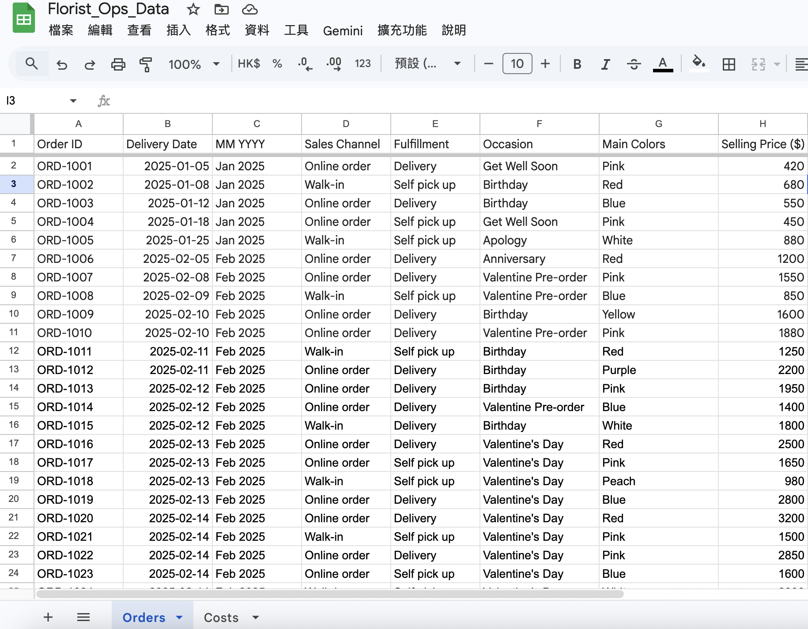
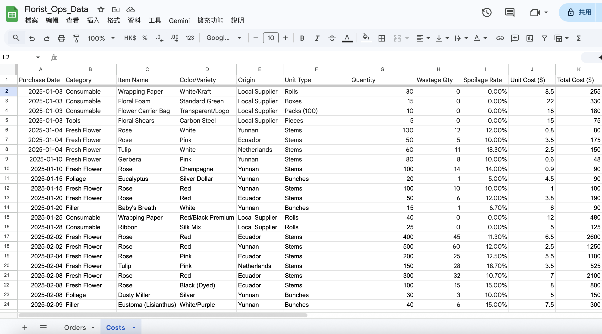
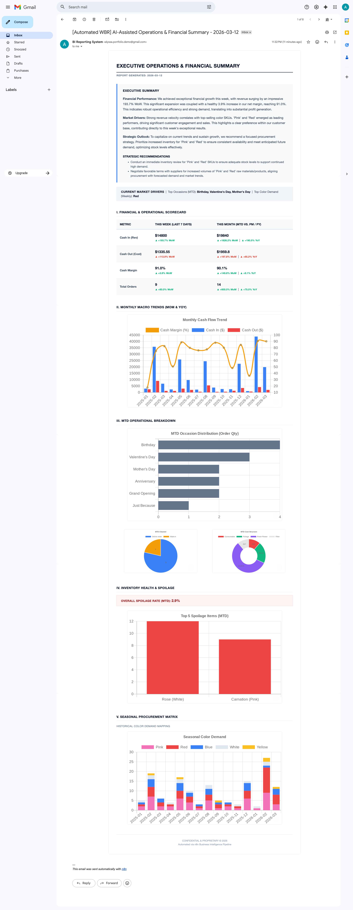
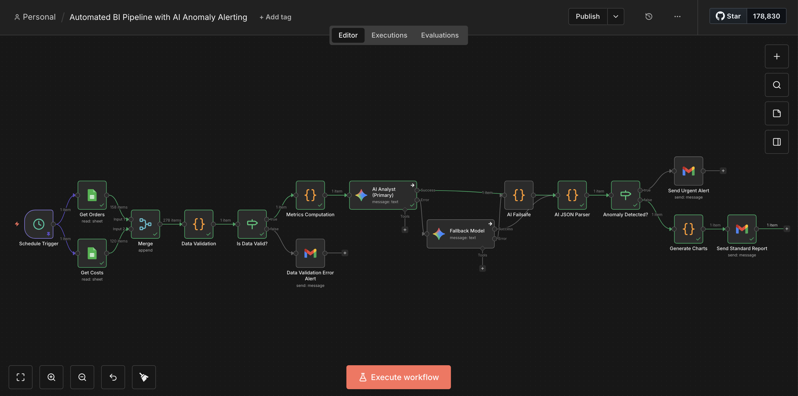

# Automated BI Reporting Workflow: From Raw Data to Visuals &amp; AI Insights

**Watch the 1-min Demo:**
<video src="https://github.com/lky012/automated-bi-reporting-n8n/raw/main/assets/demo.mov" controls="controls" muted="muted" style="max-height:640px;"></video>

**Project Summary:**
This project automates the entire analytical workflow—transforming messy raw data into a comprehensive Weekly Business Review (WBR) email. It features dynamic visual graphs and strategic business insights generated by AI.

**⭐ 2026 V2 Enterprise Upgrade Highlights:**
The pipeline has been upgraded from a standard reporting script to a production-grade, fault-tolerant architecture featuring:
- **Data Quality Gate (Data Validation):** A strict JavaScript node intercepts merging Google Sheets data. It rigorously scans for null values or invalid schemas (e.g., severe outliers like a $10,000 cost typo) and routes exceptions to operations.
- **Autonomous Anomaly Routing:** The pipeline evaluates metrics for severe anomalies (e.g., negative margins). An IF node dynamically intercepts these and fires off a highly visible 🚨 Urgent Action Alert.
- **Multi-Model AI Fallback Chain (Self-Healing):** The primary model (Gemini 2.5 Flash) features "Continue On Error" routing to a fallback model, and ultimately to a hardcoded failsafe, guaranteeing 100% reporting uptime.
- **Compute-Optimized Graph Generation:** QuickChart.io API generation is strictly decoupled from ETL computation. Charts are only rendered *after* the AI mathematically clears the raw data for anomalies.

**✨ Core Achievements:**
- **Automate:** Eliminated manual Excel work by building an end-to-end n8n pipeline.
- **Visualize:** Converted raw rows into dynamic pacing charts and horizontal bar graphs using QuickChart API.
- **Generate Insights:** Leveraged Gemini AI to read the charts and generate actionable procurement recommendations (e.g., Spoilage control, Seasonal color shifts).

## 📈 The "Before & After" Impact

### Before: Raw, Unstructured Data
Managing operations meant dealing with fragmented spreadsheets, manual calculations, and delayed insights.
 

### After: Automated, Actionable Insights
A fully automated, mobile-responsive HTML email delivered to stakeholders, featuring dynamic charts and AI-synthesized strategic advice.

---

## 💡 Business Problem & Solution

**The Challenge:** In retail and e-commerce operations, tracking critical metrics like fluctuating procurement costs, daily spoilage rates, and seasonal color demand is highly manual. This manual overhead delays strategic pivoting (e.g., shifting from Valentine's Day red roses to Spring pastel flowers).

**The Solution:**
I engineered an automated pipeline that:
1. **Extracts** live data from operational databases (Google Sheets).
2. **Sanitizes & Validates** data through a Data Quality Gate to prevent edge-case pipeline crashes.
3. **Transforms** raw inputs to calculate key financial ratios (Cash Margin, YoY Growth, Overall Spoilage Rate).
4. **Synthesizes** data using an LLM (with multi-model fallback redundancy) to generate actionable business outlooks.
5. **Delivers** a comprehensive WBR directly via Gmail.

---

## ⚙️ Technical Architecture 

![n8n Workflow] 

The pipeline is orchestrated using **n8n** and consists of the following data flow:

* **Data Ingestion:** Scheduled triggers pull live `Orders` and `Costs` data via Google Sheets API.
* **Data Validation:** A JavaScript node sanitizes inputs, flagging errors or outliers (e.g., severe cost typos).
* **Data Engineering (Merge & Code):** Custom JavaScript/Python logic handles data joining, aggregation, and performance metric calculations (MoM, YoY, MTD).
* **Exception Management:** An IF node assesses financial variances, routing severe anomalies (e.g., extreme margin drop) to an Urgent Alert prior to rendering.
* **AI Agent Integration:** The aggregated dataset is securely passed to an LLM via the `Message a model` node to draft the *Executive Summary & Strategic Outlook*, utilizing a Multi-Model Fallback for 100% uptime.
* **Dynamic Visualization:** Programmatic API calls to **QuickChart** generate real-time visual assets.
* **Automated Distribution:** The final output is formatted into a custom HTML/CSS template and dispatched via the Gmail API.

---

## 🛠️ Tech Stack & Skills Demonstrated

* **Data Engineering & Orchestration:** n8n, ETL processes, API Integration
* **Data Analytics:** Financial metrics (ROI, Cash Margin), Inventory Health (Spoilage Tracking), Trend Analysis
* **System Design:** Data Quality Gates, API Fallback Chains (Self-Healing), Exception Routing
* **Languages & Tools:** JavaScript / Python, SQL-like aggregations, HTML/CSS for email templating
* **AI & Visualization:** LLM Prompt Engineering for Business Context, QuickChart API
